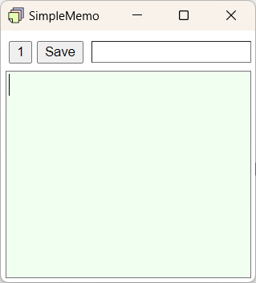

# SimpleMemo
<!--  -->


## インストール方法
### Windows
記載予定

### Mac, Linux
フォントがWindows用のため現時点で非対応

## 3つの特徴


### 1. 3つのメモを同時に管理
1つのウィンドウ内で、3つのメモを切り替えながら利用できます。

### 2. 常に前面に表示
ブラウザなどの他アプリを表示したままでもメモを参照できます。

### 3. 保存先を決めて手早く保存
保存先を事前に設定しておくことで、メモタイトルを入力するだけで素早く保存できます。

## 機能
### メモの保存
メモ保存時は、タイトル欄のテキストをファイル名として扱います（自動で拡張子.txtを付加）。保存パターンは次のとおりです。
- 新規保存 (青)
- 既存ファイルへの上書き保存 (緑)
- 読み込み済みファイルへの上書き保存 (橙)

### ファイル読み込み
テキストファイルの読み込みに対応しています。  
読み込む際は、ファイルをドラッグ&ドロップしてください。

文字コードは UTF-8 / Shift_JIS に対応しています（自動判定にも対応）。

### ショートカットキー
使用可能なショートカットキーは次のとおりです。
- `Ctrl + C`: コピー
- `Ctrl + V`: 貼り付け
- `Ctrl + X`: 切り取り
- `Ctrl + S`: 保存
- `Ctrl + T`: タイトル欄と本文テキストエリアのフォーカス切り替え
- `Ctrl + L`: メモのロック切り替え
- `Ctrl + Tab`: 次のメモへ切り替え
- `Ctrl + Shift + Tab`: 前のメモへ切り替え
- `Ctrl + Shift + .`: フォントサイズを大きくする
- `Ctrl + Shift + ,`: フォントサイズを小さくする

## ビルド方法
### Windows
```bash
cd {リポジトリのルート}
npm install           # 依存パッケージのインストール
npm run tauri dev     # 開発用ビルド(バンドル版)
npm run tauri -- dev --features portable # 開発用ビルド(ポータブル版)

npm run build:bundle    # リリースビルド(バンドル版)
npm run build:portable  # リリースビルド(ポータブル版)
```

### Mac, Linux
未対応です。


## 更新履歴
### v0.1.0
- 初版
